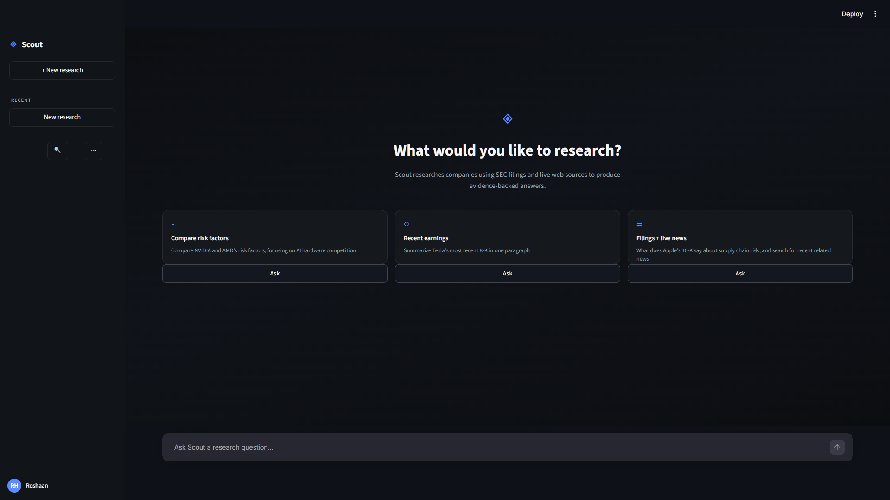
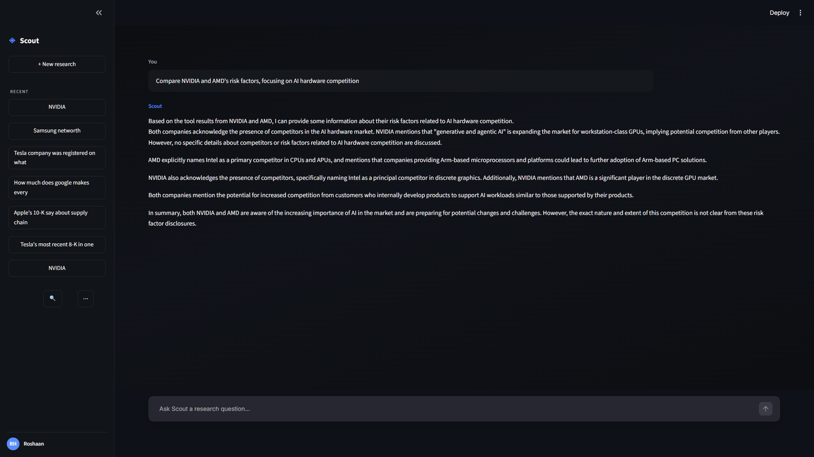

# Scout — Autonomous Research Agent

A multi-step agentic system built with LangGraph that plans, retrieves, and synthesizes information across multiple tool calls — not a single-shot chatbot wrapper, but a stateful reasoning loop with explicit control flow, loop protection, and guaranteed termination. Runs entirely on a local LLM, with zero data leaving the machine.

---



<br>



---

## What it does

Given a research goal, Scout autonomously decides which tools to reach for — live web search or retrieval-augmented search over a local knowledge base — gathers evidence across multiple steps, evaluates whether it has enough to answer, and synthesizes a grounded response. This is bounded autonomy: hard limits on tool calls, duplicate-call interception, and deterministic failure handling, engineered so the agent never spirals into an unproductive loop and never returns without a response.

Ask it something like *"Compare NVIDIA and AMD's risk factors around AI hardware competition"* and it reasons through the question, retrieves relevant SEC filing content and/or live web results, cross-checks what it finds, and answers — constrained to only state what it can actually trace back to retrieved evidence.

## Engineering highlights

- **Stateful agent orchestration** — a LangGraph `StateGraph` with conditional routing drives the agent → tools → agent loop, rather than a fixed prompt chain
- **Bounded tool-calling** — `MAX_TOOL_CALLS = 3` enforced directly in the graph's routing logic, with a dedicated `force_answer` fallback node that guarantees a synthesized response even if the ceiling is hit
- **Duplicate-call interception** — every tool call is normalized and checked against a running call history before execution, so the agent is redirected instead of wasting calls repeating an identical search
- **Hallucination mitigation** — an explicit system prompt constrains the model to answer only from retrieved tool output, added after catching the model fabricate a named executive that doesn't exist, and verified by hand against source documents
- **Retrieval grounded in real data** — ~17,000 chunks of real SEC filings (10-Ks, 10-Qs, 8-Ks, proxy statements) across 15+ major public companies, chunked and embedded into a local Chroma vector store
- **Domain-aware tool design** — the RAG tool's own description tells the agent that filings describe competitive dynamics narratively rather than naming competitors directly, and instructs it not to retry a failed query blindly

## Stack

- **Orchestration:** LangChain / LangGraph
- **LLM:** Llama 3.1 8B Instruct (Q4_K_M GGUF), served locally via LM Studio — OpenAI-compatible local inference, no cloud dependency
- **Embeddings:** sentence-transformers (`all-MiniLM-L6-v2`), local
- **Vector store:** Chroma
- **Web search:** Tavily API
- **Interface:** Streamlit (chat UI) and CLI
- **Language:** Python 3.11

## Running Locally

```bash
git clone https://github.com/yourusername/scout-autonomous-research-agent.git
cd scout-autonomous-research-agent

conda create -n agentproject python=3.11
conda activate agentproject
pip install -r requirements.txt
```

Copy `.env.example` to `.env` and add your `TAVILY_API_KEY`. Load Llama 3.1 8B Instruct in LM Studio and start the local server.

Drop your own PDFs into `documents/` and build your knowledge base:

```bash
python ingest.py
```

Run it:

```bash
python main.py          # CLI
streamlit run app.py    # Web UI
```

> `chroma_db/` and `documents/` are intentionally excluded from this repo — Scout builds its knowledge base from whatever you feed it, so anyone cloning this generates their own vector store rather than inheriting mine.

## Roadmap

- [ ] Refactor tool access to use MCP (Model Context Protocol)
- [ ] Persistent multi-turn memory across sessions
- [ ] Structured, per-claim source citations in the UI
- [ ] Support for swapping in additional local models

## Status

✅ Core agent, RAG pipeline, and UI functional and deployed — actively extending toward the roadmap above.

## Developer

Built by Roshaan Haider — Pakistani developer focused on AI integration and agentic systems engineering.
Open to freelance AI integration work and remote opportunities.

## License

MIT — free to use, modify, and learn from.
